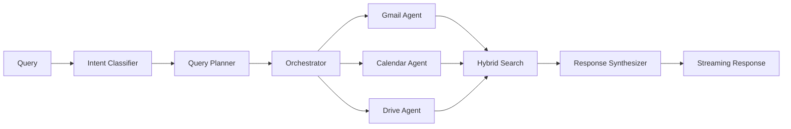
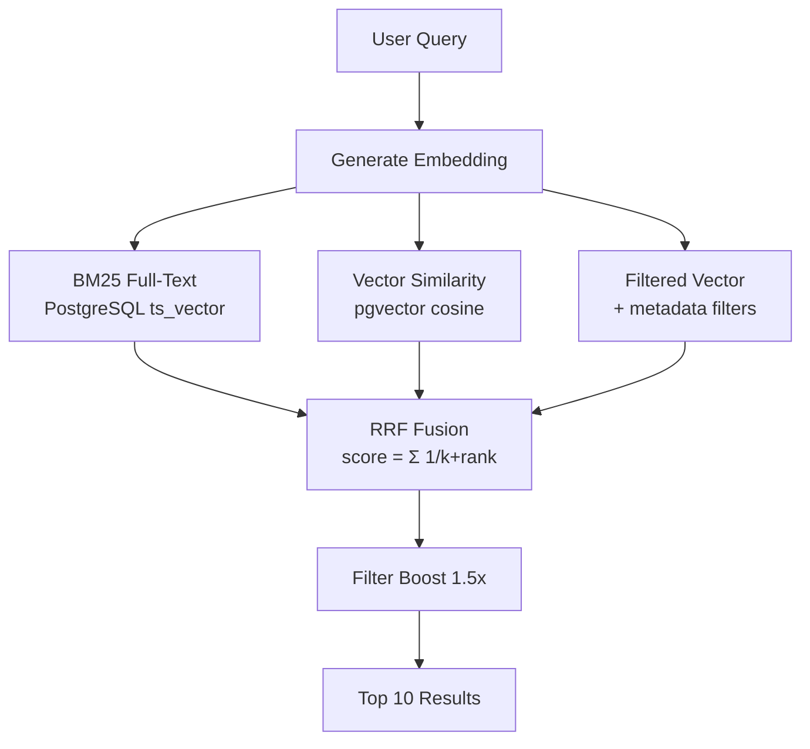

# Google Workspace Orchestrator

An intelligent orchestrator that executes natural language queries across Gmail, Google Calendar, and Google Drive.

## Features

- **Intent Classification**: LLM-powered parsing of natural language into structured intents with conversation context support
- **Multi-Service Orchestration**: Execute queries across Gmail, Calendar, and Drive with DAG-based parallel execution
- **Hybrid Search**: 3-way Reciprocal Rank Fusion combining BM25, vector similarity, and filtered search
- **Streaming Responses**: Real-time SSE streaming for conversational UX
- **Email Composition**: LLM-powered email drafting with automatic recipient resolution
- **Background Sync**: Celery workers for incremental Google API synchronization

## Quick Start

### Prerequisites
- Docker and Docker Compose
- Python 3.11+
- OpenAI API key (or Anthropic)

### Setup

1. **Clone and configure:**
   ```bash
   cp .env.example .env
   # Edit .env with your API keys
   ```

2. **Start services:**
   ```bash
   docker-compose up -d db redis
   ```

3. **Install dependencies:**
   ```bash
   pip install -r requirements.txt
   ```

4. **Run migrations:**
   ```bash
   alembic upgrade head
   ```

5. **Seed mock data:**
   ```bash
   python -m scripts.seed_mock_data
   ```

6. **Start the API:**
   ```bash
   uvicorn app.main:app --reload
   ```

7. **Open the UI:**
   ```
   http://localhost:8000/
   ```

## Architecture



### Hybrid Search Architecture

We use **3-way Reciprocal Rank Fusion (RRF)** to combine multiple search methods:



| Method | What It Does | Latency |
|--------|--------------|---------|
| **BM25** | PostgreSQL full-text search | ~5ms |
| **Vector** | Cosine similarity on embeddings | ~20ms |
| **Filtered** | Vector + metadata (sender, date) | ~20ms |

See [Design Documentation](docs/DESIGN.md) for detailed architecture and scaling strategy.

## Sample Queries

**Single Service:**
- "What's on my calendar next week?"
- "Find emails from sarah@company.com about the budget"
- "Show me PDFs in Drive from last month"

**Multi-Service:**
- "Cancel my Turkish Airlines flight"
- "Prepare for tomorrow's meeting with Acme Corp"
- "Find events that conflict with my out-of-office doc"

**Actions:**
- "Draft an email to John about the project update"
- "Send it" (after reviewing draft)
- "Create a meeting with Sarah tomorrow at 2pm"

## Project Structure

```
├── app/
│   ├── api/              # API routes and dependencies
│   ├── core/             # Core logic (intent, planner, orchestrator, synthesizer)
│   ├── agents/           # Service agents (gmail, gcal, gdrive)
│   ├── services/         # Google services, embedding, cache
│   ├── db/               # Database models and connection
│   ├── schemas/          # Pydantic schemas
│   ├── evaluation/       # Search quality benchmarks
│   └── static/           # Web UI
├── alembic/              # Database migrations
├── tests/                # Test suite
├── docs/                 # Documentation
└── scripts/              # Utility scripts
```

## API Endpoints

| Method | Endpoint | Description |
|--------|----------|-------------|
| POST | `/api/v1/query` | Process natural language query |
| POST | `/api/v1/query/stream` | Streaming query response (SSE) |
| GET | `/api/v1/health` | Health check |
| POST | `/api/v1/sync/trigger` | Trigger data sync |
| GET | `/api/v1/sync/status` | Get sync status |
| GET | `/api/v1/metrics/precision` | Search quality benchmark |

See [API Documentation](docs/API.md) for details.

## Configuration

| Variable | Description | Default |
|----------|-------------|---------|
| `DATABASE_URL` | PostgreSQL connection string | - |
| `REDIS_URL` | Redis connection string | - |
| `LLM_PROVIDER` | "openai" or "anthropic" | openai |
| `OPENAI_API_KEY` | OpenAI API key | - |
| `USE_MOCK_GOOGLE` | Use mock Google services | true |

## Testing

```bash
# Run tests
pytest

# Run with coverage
pytest --cov=app

# Run specific test file
pytest tests/test_intent.py

# Run search quality benchmark
pytest tests/test_precision.py
```

## Development

```bash
# Format code
black app tests

# Type checking
mypy app

# Lint
ruff app
```

## Technical Notes

- Built without agent frameworks (LangChain, LlamaIndex) for full control
- Uses pgvector for self-hosted vector search with IVFFlat indexes
- Custom orchestration with DAG-based parallel execution
- Hybrid search using Reciprocal Rank Fusion (RRF)
- SSE streaming for real-time responses

## Documentation

- [System Design](docs/DESIGN.md) - Architecture, ER diagrams, and scaling
- [API Reference](docs/API.md) - Endpoint documentation
- [Sample Queries](docs/sample_queries.md) - Test cases with expected outputs

## License

MIT
