# Google Workspace Orchestrator - System Design

## Overview

An intelligent orchestrator that processes natural language queries across Gmail, Google Calendar, and Google Drive using LLM-based intent classification, parallel execution, and semantic search.

## Architecture

```mermaid
flowchart TB
    subgraph Input
        Q[User Query<br/>"Cancel my Turkish Airlines flight"]
    end

    subgraph Classification
        IC[Intent Classifier<br/>LLM-powered]
    end

    subgraph Planning
        QP[Query Planner<br/>DAG Builder]
    end

    subgraph Execution
        ORCH[Orchestrator]
        subgraph Agents
            GA[Gmail Agent]
            CA[Calendar Agent]
            DA[Drive Agent]
        end
    end

    subgraph Search
        PG[(PostgreSQL<br/>pgvector)]
    end

    subgraph Synthesis
        RS[Response Synthesizer<br/>LLM-powered]
    end

    subgraph Output
        R[Natural Response]
    end

    Q --> IC
    IC --> QP
    QP --> ORCH
    ORCH --> GA & CA & DA
    GA & CA & DA --> PG
    GA & CA & DA --> RS
    RS --> R
```

## Core Components

### 1. Intent Classifier (`app/core/intent.py`)
- LLM-powered parsing of natural language into structured intents
- Extracts services, operations, entities, and execution steps
- Supports conversation context for follow-up queries
- Returns confidence scores for ambiguous queries

### 2. Query Planner (`app/core/planner.py`)
- Converts intent into execution DAG (Directed Acyclic Graph)
- Identifies dependencies between steps
- Groups independent steps for parallel execution

### 3. Orchestrator (`app/core/orchestrator.py`)
- Executes plan using `asyncio.gather` for parallelism
- Passes results between dependent steps
- Handles per-step errors gracefully

### 4. Service Agents (`app/agents/`)
- **GmailAgent**: Search, read, draft, send emails
- **GcalAgent**: Search, create, update, delete events
- **GdriveAgent**: Search, read, share files

### 5. Response Synthesizer (`app/core/synthesizer.py`)
- Aggregates results from all execution steps
- Uses LLM to generate conversational responses
- Streams responses via SSE for real-time UX

## Data Flow

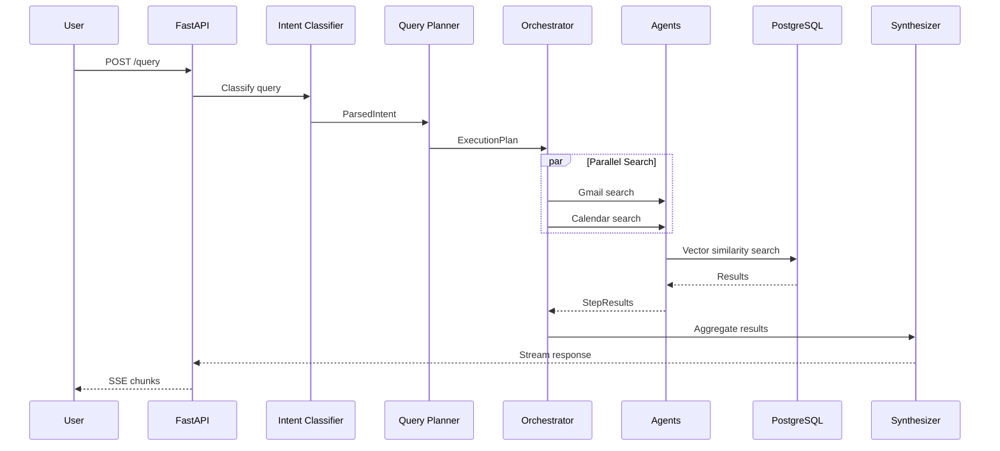

## Database Schema

### Entity Relationship Diagram

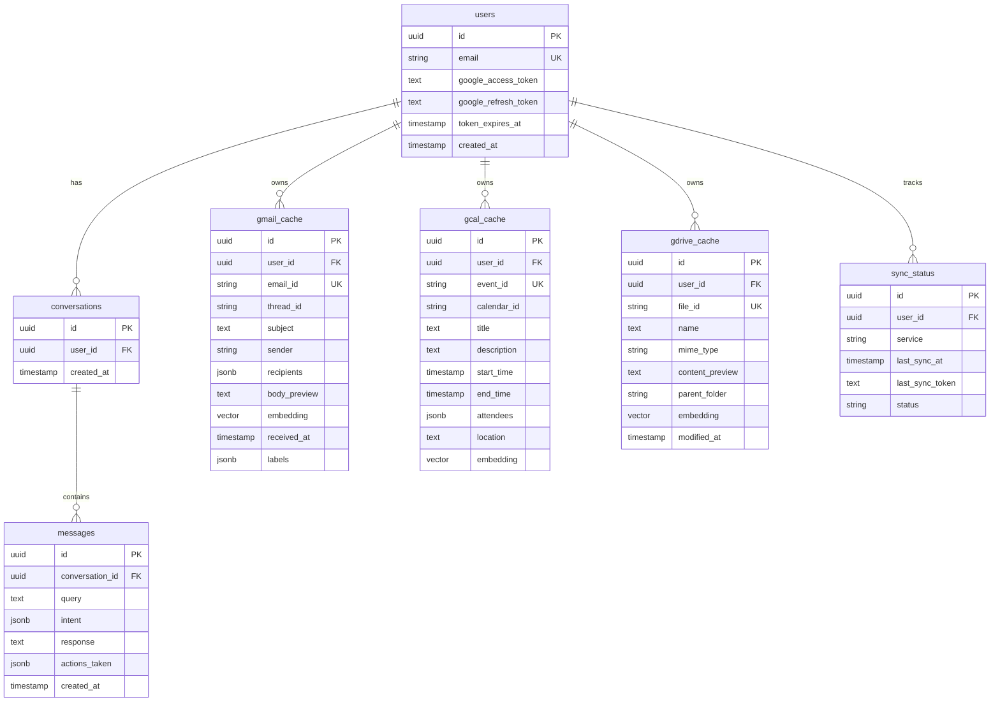

### Vector Indexes

All cache tables use IVFFlat indexes for fast cosine similarity search:

```sql
CREATE INDEX ix_gmail_embedding ON gmail_cache
USING ivfflat (embedding vector_cosine_ops);

CREATE INDEX ix_gcal_embedding ON gcal_cache
USING ivfflat (embedding vector_cosine_ops);

CREATE INDEX ix_gdrive_embedding ON gdrive_cache
USING ivfflat (embedding vector_cosine_ops);
```

---

## Search Architecture

### The Problem

Traditional keyword search fails for natural language queries:
- "emails about the budget" won't match "Q4 Financial Review"
- "meetings with Sarah" needs to understand attendee fields
- Users expect Google-like relevance from semantic understanding

### Our Solution: 3-Way Hybrid Search with RRF Fusion

We combine three retrieval methods and fuse them using Reciprocal Rank Fusion (RRF):

```mermaid
flowchart TB
    subgraph Input
        Q[User Query<br/>"emails about budget from Sarah"]
        E[Generate Embedding<br/>1536-dim vector]
    end

    subgraph "Parallel Search (3 methods)"
        subgraph BM25["1. BM25 Full-Text Search"]
            BM25_Q[PostgreSQL ts_vector]
            BM25_R[Keyword matches<br/>~5ms latency]
        end

        subgraph Vector["2. Vector Similarity Search"]
            VEC_Q[pgvector cosine distance]
            VEC_R[Semantic matches<br/>~20ms latency]
        end

        subgraph Filtered["3. Filtered Vector Search"]
            FIL_Q[Vector + metadata filters<br/>sender='Sarah']
            FIL_R[Precise matches<br/>~20ms latency]
        end
    end

    subgraph Fusion
        RRF[RRF Score Calculation<br/>score = Σ 1/(k + rank)]
        BOOST[Filter matches get 1.5x boost]
        DEDUP[Deduplicate by ID]
    end

    subgraph Output
        TOP[Top 10 Results<br/>Best of all methods]
    end

    Q --> E
    E --> BM25_Q --> BM25_R
    E --> VEC_Q --> VEC_R
    E --> FIL_Q --> FIL_R

    BM25_R --> RRF
    VEC_R --> RRF
    FIL_R --> RRF

    RRF --> BOOST --> DEDUP --> TOP
```

### How Each Search Method Works

| Method | What It Does | Strengths | Latency |
|--------|--------------|-----------|---------|
| **BM25** | PostgreSQL full-text search using `ts_vector` | Fast, exact keyword matches, handles typos | ~5ms |
| **Vector** | Cosine similarity on 1536-dim embeddings | Semantic understanding, finds related concepts | ~20ms |
| **Filtered Vector** | Vector search + metadata filters (date, sender) | Combines semantic + precise constraints | ~20ms |

### Why RRF Fusion?

**Reciprocal Rank Fusion** is simple and effective:

```
RRF_score(doc) = Σ (1 / (k + rank_i))
```

- `k = 60` (standard constant)
- No training required - works out of the box
- Handles different score scales automatically
- We add a **1.5x boost** for filter matches (when user specifies sender/date)

### Example: "emails from Sarah about budget"

```
BM25 Results:        [email_A (rank 1), email_C (rank 2), email_B (rank 3)]
Vector Results:      [email_B (rank 1), email_A (rank 2), email_D (rank 3)]
Filtered Results:    [email_A (rank 1), email_B (rank 2)]  ← sender=Sarah filter

RRF Calculation:
  email_A: 1/(60+1) + 1/(60+2) + 1.5×1/(60+1) = 0.0410  ← TOP RESULT
  email_B: 1/(60+3) + 1/(60+1) + 1.5×1/(60+2) = 0.0398
  email_C: 1/(60+2) = 0.0161
  email_D: 1/(60+3) = 0.0159

Final Ranking: [email_A, email_B, email_C, email_D]
```

### Search Quality Target

**Precision@5 > 0.8**: At least 4 of the top 5 results should be relevant.

We measure this with automated benchmarks using ground-truth relevance checks.

---

## Scaling to 1M Users

### Why These Technology Choices?

| Component | Choice | Why It Scales |
|-----------|--------|---------------|
| **FastAPI** | Async Python framework | Single process handles 1000s of concurrent requests via async/await |
| **PostgreSQL + pgvector** | Relational DB with vector extension | Proven at scale, ACID compliance, familiar tooling, read replicas for scaling |
| **Redis** | In-memory cache | Sub-millisecond reads, handles 100k+ ops/sec per node |
| **Celery** | Task queue | Horizontal scaling of background workers, battle-tested |
| **Kubernetes** | Container orchestration | Auto-scaling, self-healing, declarative infrastructure |

### Architecture for Scale

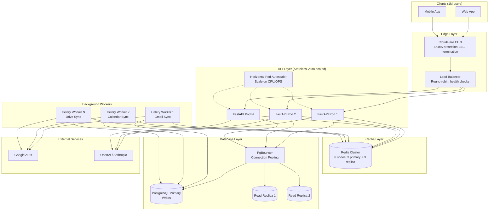

### Capacity Planning

| Metric | Value | Calculation |
|--------|-------|-------------|
| Total Users | 1,000,000 | - |
| Daily Active Users | 300,000 | 30% DAU (typical SaaS) |
| Queries/User/Day | 10 | Average usage |
| Daily Queries | 3,000,000 | 300K × 10 |
| Average QPS | 35 | 3M / 86,400 |
| Peak QPS | 100 | 3x peak multiplier |
| Design Target | 500 QPS | 5x headroom |
| Storage/User | ~45MB | 5K emails + 500 events + 200 files |
| Total Storage | ~45TB | 1M × 45MB |

### How Each Layer Scales

#### 1. API Layer (Stateless)

**Deployment Options:**
- **AWS ECS** with auto-scaling (simpler) - recommended for most cases
- **Kubernetes** with HPA (more control) - for complex orchestration needs

```
Auto-scaling Configuration:
├── Min instances: 3 (always running)
├── Max instances: 50 (scale ceiling)
├── Scale-up trigger: CPU > 70% or QPS > 100/instance
├── Scale-down trigger: CPU < 30% for 5 minutes
└── Use Spot Instances for workers (70% cost savings)
```

**Why it works**: Each instance handles ~100 QPS. For 500 QPS, we need 5 instances. Auto-scaler adds instances as load increases. Spot instances for background workers reduce costs significantly.

#### 2. Database Layer (PostgreSQL)

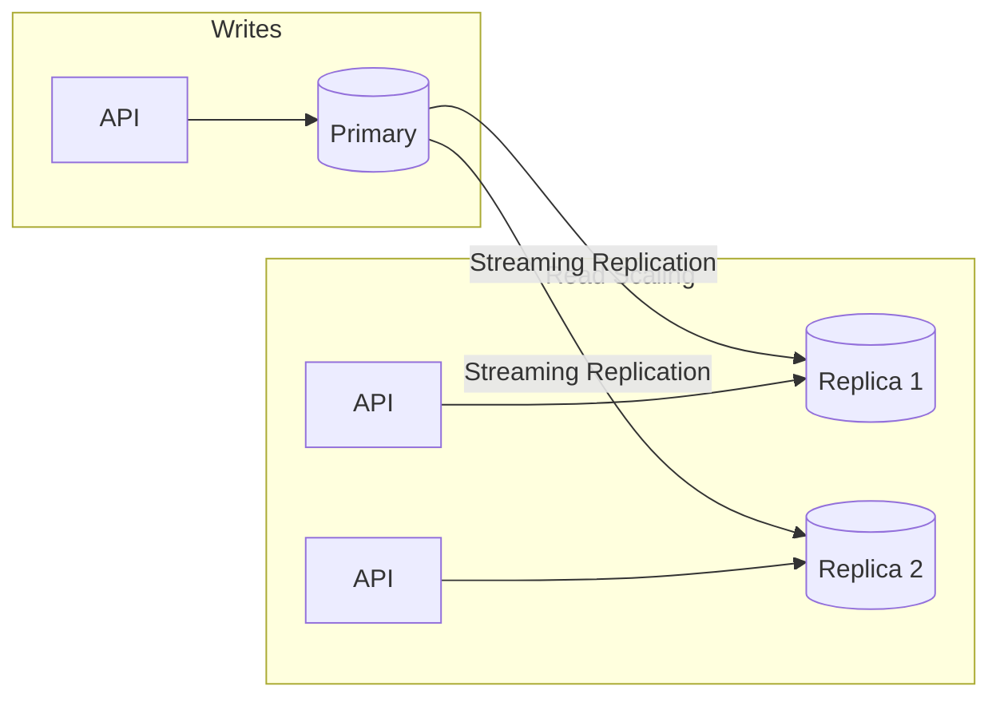

**Why it works**:
- **Read replicas**: 90% of queries are reads (search). Add replicas to scale reads linearly
- **Connection pooling**: PgBouncer maintains pool of connections, prevents connection exhaustion
- **Sharding** (if needed): Hash user_id across 4 shards, each handling 250K users

#### 3. Cache Layer (Redis)

```
┌─────────────────────────────────────────────────────────────┐
│                    What We Cache                             │
├─────────────────────────────────────────────────────────────┤
│ Conversation Context    │ 60 min TTL  │ Reduces DB reads    │
│ Query Embeddings        │ 1 hour TTL  │ Saves embedding API │
│ Recent Search Results   │ 5 min TTL   │ Instant responses   │
│ Rate Limit Counters     │ 1 hour TTL  │ Fast rate checking  │
│ User Session Data       │ 24 hour TTL │ Auth performance    │
└─────────────────────────────────────────────────────────────┘
```

**Why it works**: Redis handles 100K+ operations/second. Most repeated queries hit cache, not DB.

#### 4. Background Sync (Celery)

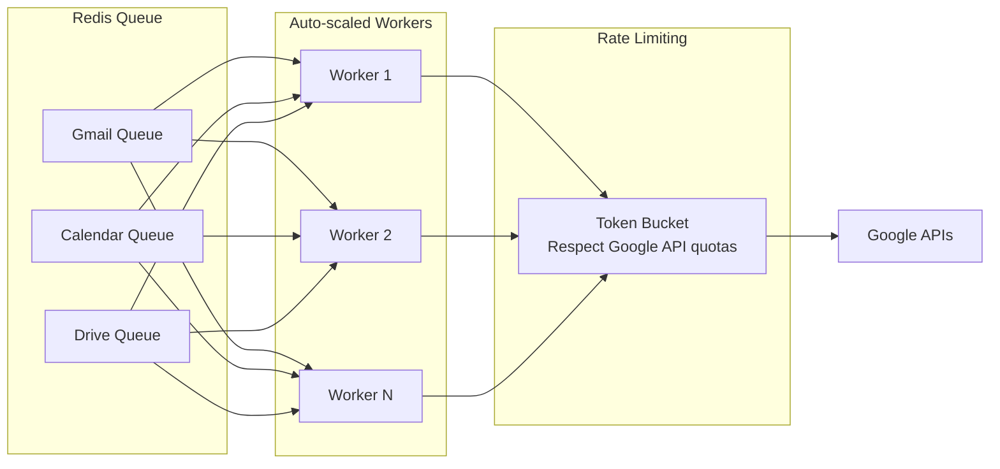

**Why it works**:
- Workers scale independently of API servers
- Priority queues: active users synced first
- Incremental sync with Google's sync tokens (delta updates only)
- **Use Spot Instances** for sync workers (can handle interruptions, 70% cheaper)

#### 5. How It All Works Together (Real-Time Feel)

The key insight: **Users never wait for Google APIs**. Here's why everything feels instant:

**Two Types of "Parallelism" (Important Distinction):**

| Type | What It Is | Where It Runs | Example |
|------|-----------|---------------|---------|
| **Background Workers (Celery)** | Separate processes | Independent of API server | Google sync every 5 min |
| **Async I/O (asyncio)** | Concurrent within request | Same process, non-blocking | Parallel DB queries |

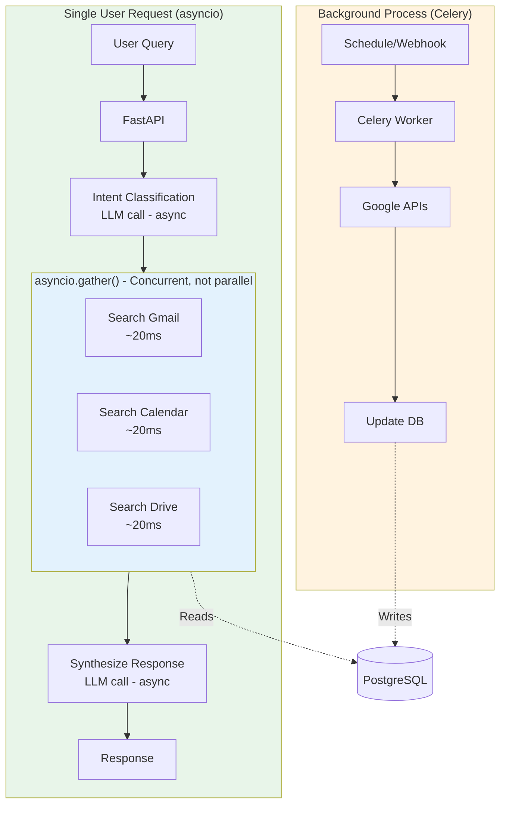

**What Runs Where:**

```
┌─────────────────────────────────────────────────────────────────────────────┐
│                                                                             │
│  BACKGROUND (Celery Workers - Separate Processes):                          │
│  └── Only Google API sync                                                   │
│      ├── Scheduled sync (every 5-15 min)                                    │
│      ├── Webhook-triggered sync (immediate on new email)                    │
│      └── On-demand sync (user requests refresh)                             │
│                                                                             │
│  WITHIN REQUEST (asyncio - Same Process, Non-Blocking):                     │
│  └── Everything else is async I/O                                           │
│      ├── LLM calls (intent classification, response synthesis)              │
│      ├── Database queries (parallel with asyncio.gather)                    │
│      ├── Redis cache reads/writes                                           │
│      └── Embedding API calls                                                │
│                                                                             │
│  User IS waiting for async I/O, but operations run concurrently,            │
│  not sequentially. 3 DB queries take ~20ms total, not 60ms.                 │
│                                                                             │
└─────────────────────────────────────────────────────────────────────────────┘
```

**Why It Feels Instant:**

1. **Pre-cached Data** (Background): Celery workers sync Google → PostgreSQL. Queries hit local DB, not Google.

2. **Concurrent I/O** (asyncio): Within a request, we run Gmail + Calendar + Drive searches simultaneously:
   ```python
   # This runs all 3 concurrently, not sequentially
   results = await asyncio.gather(
       gmail_agent.search(params),
       calendar_agent.search(params),
       drive_agent.search(params)
   )
   # Total time: ~20ms (slowest), not ~60ms (sum)
   ```

3. **Non-blocking LLM calls**: While waiting for LLM response, the event loop handles other requests.

4. **SSE Streaming**: Response streams to user as LLM generates it - no waiting for full completion.

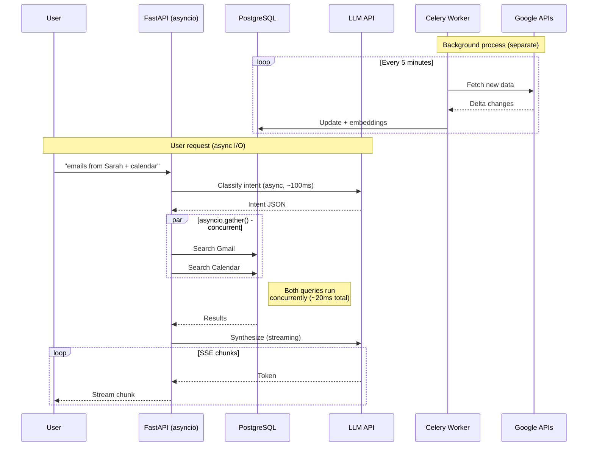

**Summary:**
- **Only sync workers are true background processes** (Celery)
- **Everything else is async I/O** within the request (user waits, but operations run concurrently)
- This combination gives sub-second responses while keeping data fresh

---

## External API Handling

### The Challenge

We depend on external APIs that can be slow, rate-limited, or unavailable:
- **Google APIs**: Gmail, Calendar, Drive (rate limits per user)
- **LLM APIs**: OpenAI/Anthropic (rate limits, latency varies)
- **Embedding API**: OpenAI embeddings (rate limits)

### Our Solution: Resilient API Layer

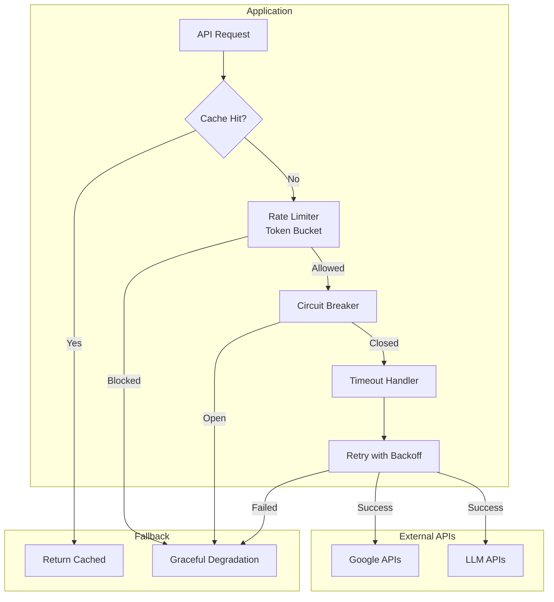

### Google API Strategy

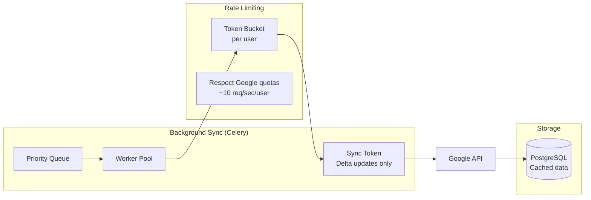

**Key Strategies:**
| Strategy | Implementation | Why |
|----------|----------------|-----|
| **Delta Sync** | Use Google's sync tokens | Only fetch changes, not entire mailbox |
| **Priority Queue** | Active users synced first | Better UX for engaged users |
| **Batch Requests** | Group API calls | Reduce round trips, stay under limits |
| **Exponential Backoff** | 1s → 2s → 4s → 8s | Handle rate limit errors gracefully |

### LLM API Strategy

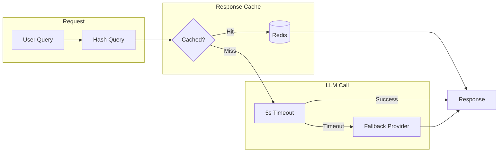

**Key Strategies:**
| Strategy | Implementation | Why |
|----------|----------------|-----|
| **Response Caching** | Cache intent classifications (5 min TTL) | Same query = same intent |
| **Embedding Caching** | Cache embeddings (1 hour TTL) | Embeddings are deterministic |
| **Timeout + Fallback** | 5s timeout, fallback to simpler model | Prevent hanging requests |
| **Provider Abstraction** | `LLMProvider` interface | Switch OpenAI ↔ Anthropic easily |

---

## Rate Limiting

### Multi-Layer Rate Limiting

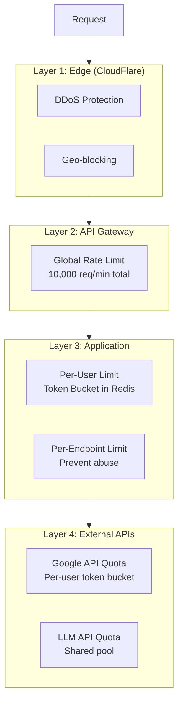

### Token Bucket Implementation

```
User Rate Limit (Redis):
┌─────────────────────────────────────────────────────────────┐
│  Key: rate_limit:{user_id}                                  │
│  Structure: {tokens: 100, last_refill: timestamp}           │
│                                                             │
│  Algorithm:                                                 │
│  1. Check tokens available                                  │
│  2. If tokens > 0: decrement and allow                      │
│  3. If tokens = 0: reject with 429                          │
│  4. Refill tokens every minute (sliding window)             │
│                                                             │
│  Tiers:                                                     │
│  ├── Free:       100 requests/hour                          │
│  ├── Pro:        1,000 requests/hour                        │
│  └── Enterprise: 10,000 requests/hour                       │
└─────────────────────────────────────────────────────────────┘
```

**Why Redis for Rate Limiting?**
- Atomic operations (`INCR`, `EXPIRE`)
- Sub-millisecond latency
- Shared state across all API instances
- Built-in TTL for automatic cleanup

---

## Why Our Code Scales

### Architecture Principles

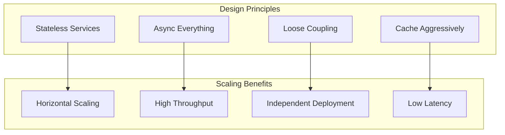

### Code-Level Design Choices

| Design Choice | How It's Implemented | Why It Scales |
|---------------|---------------------|---------------|
| **Stateless API** | No session state in memory, all state in Redis/PostgreSQL | Add more instances without coordination |
| **Async/Await** | FastAPI + asyncio throughout | Single process handles 1000s of concurrent connections |
| **Parallel Execution** | `asyncio.gather()` for multi-service queries | Gmail + Calendar + Drive searched simultaneously |
| **Connection Pooling** | SQLAlchemy async pool, Redis pool | Reuse connections, prevent exhaustion |
| **Dependency Injection** | FastAPI `Depends()` | Swap implementations (mock ↔ real) without code changes |
| **Interface Abstraction** | `BaseAgent`, `LLMProvider` interfaces | Add new services/providers without changing core |

### Request Flow (Scalability View)

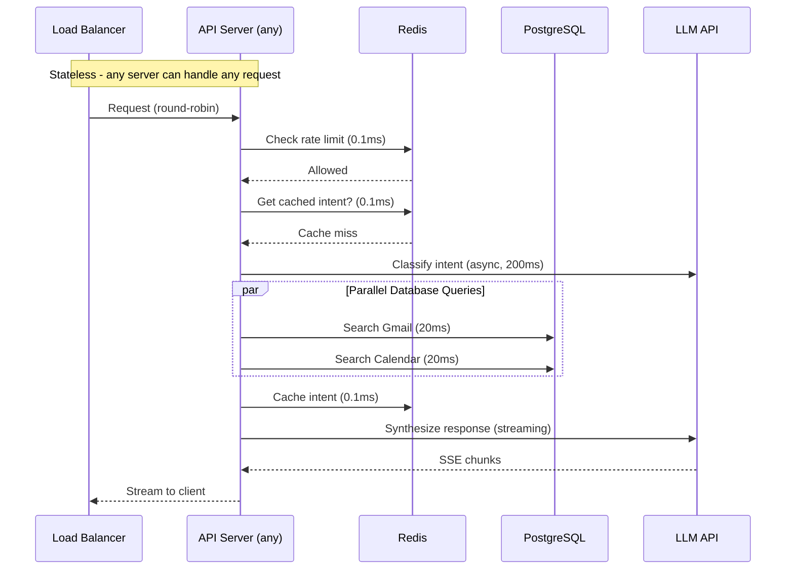

### Bottleneck Analysis

| Component | Current Limit | How to Scale |
|-----------|---------------|--------------|
| **API Servers** | ~100 QPS each | Add more instances (horizontal) |
| **PostgreSQL** | ~1000 QPS | Add read replicas, then shard |
| **Redis** | ~100K ops/sec | Redis Cluster (6+ nodes) |
| **LLM API** | Provider limits | Cache responses, multiple providers |
| **Google API** | Per-user quotas | Respect limits, queue excess |

### What Makes Scaling Easy

1. **No Shared State**: Each request is independent, no coordination needed
2. **Safe Retries**: Read operations are idempotent, writes use unique IDs
3. **Async I/O**: Don't block on network calls
4. **Clear Boundaries**: Services communicate via well-defined interfaces
5. **Observable**: Metrics/logs at every layer for debugging

### Idempotency & Safe Retries

Not all operations are idempotent, but we design for safe retries:

```
┌─────────────────────────────────────────────────────────────────────────┐
│                        Operation Idempotency                             │
├─────────────────────────────────────────────────────────────────────────┤
│                                                                          │
│  NATURALLY IDEMPOTENT (safe to retry):                                   │
│  ├── search_gmail, search_calendar, search_drive                         │
│  ├── get_email, get_event, get_file                                      │
│  └── All cache reads/writes (same key = same result)                     │
│                                                                          │
│  MADE IDEMPOTENT BY DESIGN:                                              │
│  ├── send_email: Uses draft_id (draft deleted after send)                │
│  │   └── Retry sends nothing if draft already sent                       │
│  ├── create_event: Client can provide event_id                           │
│  │   └── Same ID = update instead of duplicate                           │
│  └── sync operations: Use sync_token                                     │
│       └── Same token = same delta, no duplicate processing               │
│                                                                          │
│  NOT IDEMPOTENT (handle carefully):                                      │
│  ├── draft_email: Creates new draft each time                            │
│  │   └── Mitigation: Check for existing draft before creating            │
│  └── share_file: May send duplicate share notifications                  │
│       └── Mitigation: Check existing permissions first                   │
│                                                                          │
└─────────────────────────────────────────────────────────────────────────┘
```

**How We Handle Non-Idempotent Operations:**

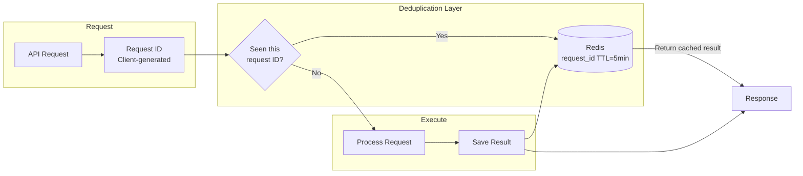

**Key Patterns:**
| Pattern | Implementation | Example |
|---------|----------------|---------|
| **Request Deduplication** | Store request_id in Redis with TTL | Retry same request → return cached response |
| **Unique Resource IDs** | draft_id, event_id from previous step | send_email uses draft_id, can't send twice |
| **Sync Tokens** | Google's incremental sync tokens | Re-sync with same token = no duplicate data |
| **Optimistic Locking** | Check version before update | Prevent concurrent modifications |

---

## Performance Targets

| Metric | Target | How We Achieve It |
|--------|--------|-------------------|
| Availability | 99.9% | Multi-AZ deployment, auto-healing |
| P50 Latency | < 500ms | Caching, parallel execution |
| P99 Latency | < 2s | Timeouts, circuit breakers |
| Search Precision@5 | > 0.8 | Hybrid search with RRF |

## Security

- **OAuth 2.0** for Google API authentication
- **JWT tokens** for API authentication
- **Encrypted tokens** at rest (AES-256)
- **Rate limiting** per user (token bucket in Redis)
- **Input validation** and sanitization
- **HTTPS everywhere**

## Technology Stack

| Component | Technology | Why |
|-----------|------------|-----|
| API Framework | FastAPI | Async, fast, automatic OpenAPI docs |
| Database | PostgreSQL + pgvector | Proven, vector search, ACID |
| Cache | Redis | Sub-ms latency, pub/sub for events |
| Task Queue | Celery | Reliable, scalable background jobs |
| LLM | OpenAI / Anthropic | Best-in-class language models |
| Embeddings | text-embedding-3-small | Good quality, low cost, fast |
| Container | Docker | Portable, reproducible builds |
| Orchestration | ECS / Kubernetes | Auto-scaling, simpler ops with ECS |
| Cost Optimization | Spot Instances | 70% savings for background workers |
